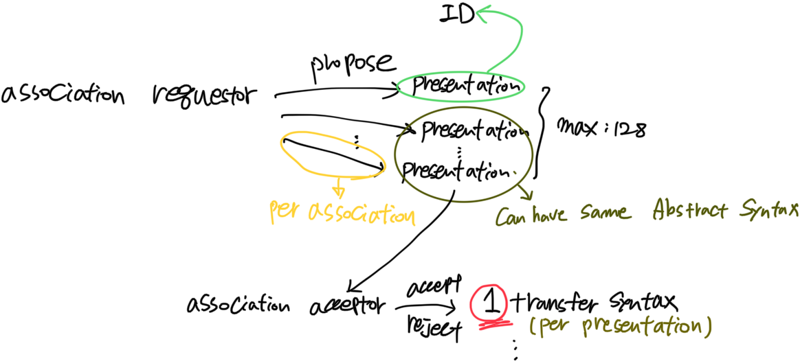

# pynetdicom
A pure Python package that implements the DICOM networking protocol.
([Official Document](https://pydicom.github.io/pynetdicom/stable/user/concepts.html#presentation-contexts)) 

## Important Concepts

### UID
* A way of identifying a wide variety of items.  
* Composed with:`<org root>.<suffix>` (total 64 characters)
    * `<org root>`: Use DICOM officla root (`1.2.840.10008`)
* See details in [Part 5](http://dicom.nema.org/medical/dicom/current/output/chtml/part05/PS3.5.html)

### Information Model

#### IOD (Information Object Definition, See [Part 3](http://dicom.nema.org/medical/dicom/current/output/chtml/part03/PS3.3.html))
* Specifies information about object
  * ex) Patient, Study, Image Series, Piece of Imaging Equipment
  * Patient ⊃ Study ⊃ Image Series ⊃ Piece of Imaging Equipment
* Defines relationship between Objects
* Two types:
  * Composite IODs: related objects
  * Normalised IODs: single class
    
#### SOP (Service-Object Pair) Class
* Union of IOD and DIMSE(<u>**DI**</u>COM <u>**M**</u>essage <u>**S**</u>ervice <u>**E**</u>lement)
* Has its own UID (See [Part 6](http://dicom.nema.org/medical/dicom/current/output/chtml/part06/PS3.6.html))
* Two types: Composite / Normalised

#### Service Class (See [Part 4](http://dicom.nema.org/medical/dicom/current/output/chtml/part04/PS3.4.html))
* Group of SOP classes (related to service / rule)
  * Service: used by communicating `Application Entities`
  * Rule: Govern provision of the service
  * `AE`가 Service를 공급하는지 사용하는지에 따라 두 가지 Class로 파생됨
    * SCU (Service Class User)
    * SCP (Service Class Provider)
  
### Application Entities (AE)
* Application supporting `DICOM Standard`, `IOD`, `Service Class`, dataset en/decoding
* Identified by AE `Title`

### Presentation Context
* See [Detailed guide](https://pydicom.github.io/pynetdicom/stable/user/presentation.html#user-presentation)
* Used during negotiation of an association
  * 통신중인 AE들이 지원되는 Service에 동의하도록 method 제공
* `1 Abstract Syntax` + `n Transfer Syntax` + `ID`

#### Abstract Syntax
* Specification of a set of `data elements` and their associated semantics
* Identified by `Abstract Syntax Name` in UID
  * `Abstract Syntax Name` (usually) officially registered SOP class(= Abstract Syntax) UID
  * Private also allowed
    * Can handle negotiation 
    * But implementation of `service/semantics` is up to user

#### Transfer Syntax (See [part 5 chap 8](http://dicom.nema.org/medical/dicom/current/output/chtml/part05/chapter_8.html))
* Defines a set of encoding rule
  * Abstract syntax로 정의된 data element를 모호하지 않게 표현
* Negotiation &rarr; AE communication을 위한 encoding technique 설정
* Standard also allows the use of privately defined transfer syntaxes
  * `Encoding requirement` 구현은 end user가 해야함

### Association
* Peer AEs want to communicate &rarr; Establish an Association First
  * AE to AE connection
* `Requestor` - `Acceptor` relation
  * Requestor: AE that initiating association. Send an `A-ASSOCIATE` message.
  * Acceptor: Contains a list of proposed presentation context, association negotiation items
    * Respond of request:
      * `Acceptance` - association being established
      * `Rejection` - no association (See [Part 8 sec 9.3.4](http://dicom.nema.org/medical/dicom/current/output/chtml/part08/sect_9.3.4.html))
      * `Abort` - no association
  * See full service procedure for an association [here](http://dicom.nema.org/medical/dicom/current/output/chtml/part08/chapter_7.html#sect_7.1.2)
  
#### Association Negotiation / Extended Negotiation
* Usually involves the peer AEs agreeing on set of abstract/transfer syntax combination
* Maybe necessary for communicating AEs to exchange more detailed info
  * Features, Services (may optionally require/support)
* Accomplished by sending additional user information items during association request
* Additional user information items (involving these &rarr; Extended Negotiation):
  * See [Part 7-D](http://dicom.nema.org/medical/dicom/current/output/chtml/part07/chapter_D.html), [Part 8-D](http://dicom.nema.org/medical/dicom/current/output/chtml/part08/chapter_D.html)
  * `Asynchronous Operation Window` Negotiation
  * `SCP/SCU Role Selection` Negotiation
  * `SOP Class Extended` Negotiation
  * `SOP Class Common Extended` Negotiation
  * `User Identify` Negotiation
  * Conditionally required depending on requested `Service Class`

### Event
* Data/PDU exchange between services (inter-AE)
* Data exchange between AEs (intra-AE)
* Types:
  * Notification
    * Don't need to return/yield
    * Can have multiple handler, raised exception &rarr; log
  * Intervention
    * Must return/yield expected value
    * Only single handler

